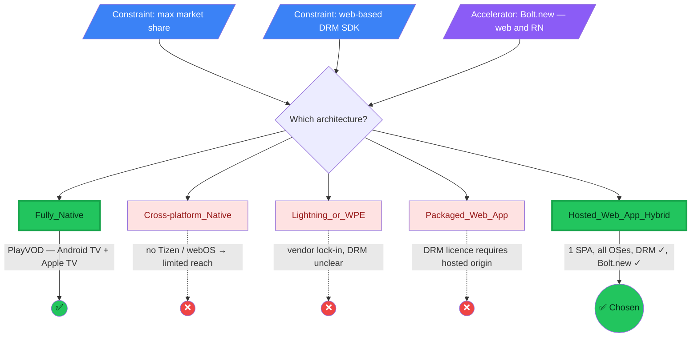
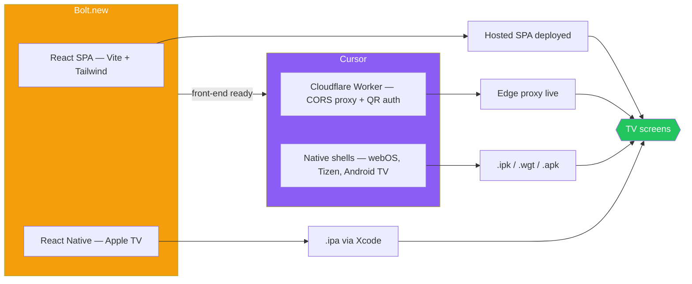
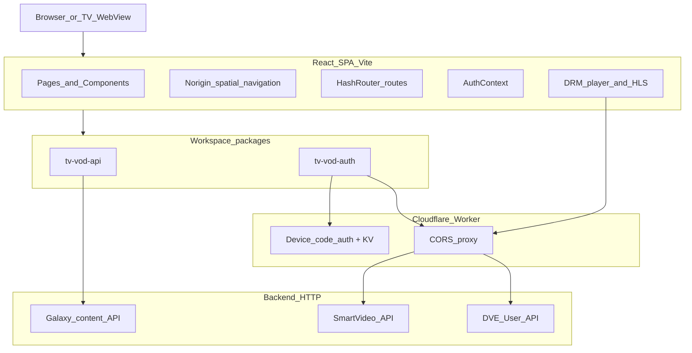
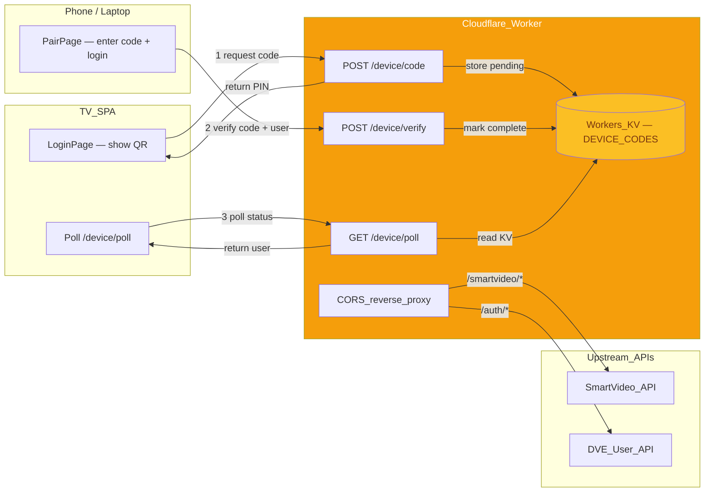
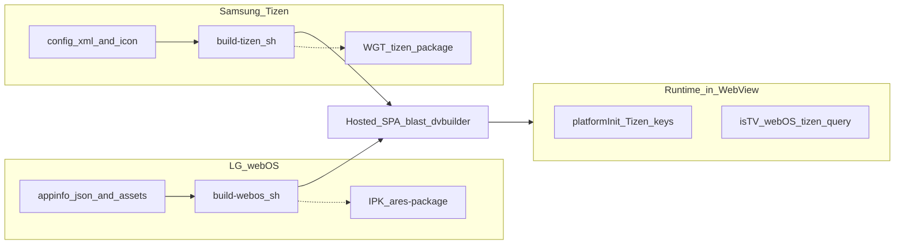

# TV VOD ARCHITECTURE

  

    
    ARCHITECTURE
    
    STARTING POINT
    SMARTPHONES
    PLAYVOD
    
    

      TV
      NATIVE FIRST
      DEMOS
    

    
    

      CONTEXT
      OPTIONS
      DEVELOPMENT
    

    
    

      WORKFLOW
      FRONT-END
      BOLT.NEW
    

    
    

      SERVER
      CLOUDFLARE
      WORKER
    

    
    

      NATIVE LAYER
      WEBOS
      ANDROID
    

    
    

      TIZEN
      APPLETV
      DEMOS
    

    
    THANK YOU
    
  

---

## Starting Point — PlayVOD on Smartphones

### We already have a native streaming app

**PlayVOD** is our existing native mobile app, live on Android and iOS. We own and maintain the full codebase, and the team has deep expertise in the native stack.

- **Platforms:** Android (Kotlin) + iOS (Swift)
- **Core stack:** native DRM player SDK (per-platform), licence management, content APIs, business logic, user authentication
- **Team expertise:** full ownership of the codebase — we build, ship and maintain it

---

## From Smartphones to TV — Native First

### Low-effort extension to Android TV & Apple TV

Because we already own the PlayVOD native codebase, we were able to extend it to TV with minimal effort — **reusing ~90 % of the existing code**.

| Layer | Reused from PlayVOD | TV-specific adaptation |
|---|---|---|
| **DRM player + licence** | ✅ Same SDK, same licence | — |
| **Business logic & APIs** | ✅ Content, auth, payments | — |
| **Native SDKs** | ✅ Same per-platform SDKs | — |
| **UI / UX** | Partial | New TV layouts, D-pad navigation, 10-foot UI |

- **Android TV:** same Kotlin codebase + TV-specific Activity / Leanback UI → `.apk`
- **Apple TV (tvOS):** same Swift codebase + TVUIKit / focus engine → `.ipa`
- **Result:** two fully native TV apps shipped with a fraction of the effort of building from scratch

> This gives us Android TV and Apple TV. But what about the rest of the market — **Samsung (Tizen) and LG (webOS)**?

---

## Demos — Native TV Apps

| Platform | Demo link |
|---|---|
| **Android TV** | [▶ Android TV demo](video-demo/android_native_tv_demo.mp4) |
| **Apple TV** | [▶ Apple TV demo](video-demo/tvOS_demo.mp4) |

---

## Context

### Global Smart TV OS Market Share (Shipments & Installed Base)

Globally, Android/Google TV leads in total installations, while Tizen leads in usage, particularly due to Samsung's strong hardware sales.

- **Android/Google TV:** Holds the top spot in global shipments, with some reports placing it above 24% and projected to remain dominant.
- **Tizen (Samsung):** Ranked No. 1 in global installed base, with approximately 12.8%–17% market share.
- **webOS (LG):** A strong third place, capturing around 11%–12% of global shipments.

---

## TV App Architecture — Options

### Which architecture for a Smart TV app?

**Three drivers shape the decision:**

1. **Maximise market coverage** — the app must ship on Android/Google TV, Tizen (Samsung), webOS (LG), and ideally Apple TV — together >60 % of global Smart TV shipments.
2. **Web-based DRM SDK** — our playback stack relies on [`@digitalvirgo/drm-player`](https://github.com/matteoburgassi/drm-player), a façade built ad-hoc to wrap the licensed DRM SDK into a simple, reusable component that Bolt.new can drop in. It runs in a browser / WebView context; any architecture that cannot host a web runtime is ruled out.
3. **Bolt.new as accelerator** — we have access to Bolt.new, an AI-powered rapid prototyping tool that excels at generating web apps (React, Vite) and React Native projects. This makes web-based and React Native architectures significantly faster to bootstrap and iterate on.

| Approach                    | Description                                       | Pros                                                                                                                                             | Cons                                                                                       | Verdict |
| --------------------------- | ------------------------------------------------- | ------------------------------------------------------------------------------------------------------------------------------------------------ | ------------------------------------------------------------------------------------------ | ------- |
| **Fully Native**            | One native app per OS (Swift / Kotlin / C++)      | Best performance & platform APIs                                                                                                                 | N codebases, N teams; N DRM SDK integrations (one per platform); no Bolt.new leverage      | ✅       |
| **Cross-platform Native**   | Single codebase → native (React Native, Flutter)  | Shared logic, native rendering; Bolt.new can scaffold RN                                                                                         | No Tizen / webOS support → misses ~25 % market; DRM SDK needs a WebView                    | ❌       |
| **Lightning / WPE**         | TV-specific JS framework (Metrological)           | Built for low-end SoCs, operator ecosystem                                                                                                       | Vendor lock-in, smaller community; DRM SDK integration not guaranteed; no Bolt.new support | ❌       |
| **Packaged Web App**        | Bundled HTML/JS/CSS inside each shell             | Offline-capable, store-distributed; Bolt.new can generate the web app                                                                            | DRM SDK licence requires hosted origin; every update needs re-packaging & re-submission    | ❌       |
| **Hosted Web App (Hybrid)** | Thin native shell loads a remote SPA in a WebView | Single codebase, OTA updates, DRM SDK runs in its licensed web origin, covers all target OSes; **Bolt.new ideal for rapid React/Vite iteration** | Needs connectivity; WebView perf varies by device                                          | ✅       |

### Diagram — architecture decision

> **Decision:** Only the **Hosted Web App (Hybrid)** satisfies all three drivers — the DRM player SDK runs in its licensed web origin inside a WebView, thin native shells on webOS, Tizen, Android TV and Apple TV give us maximum market coverage, and Bolt.new lets us rapidly prototype and iterate on the React/Vite SPA that powers every platform.

---

## Development Workflow

### Two AI tools, two domains

| Phase | Tool | Scope | Output |
|---|---|---|---|
| **1 — Front-end** | **Bolt.new** | React SPA (Vite, Tailwind, spatial nav) + React Native (Apple TV) | UI, pages, playback, routing — the web app that runs everywhere |
| **2 — Infrastructure** | **Cursor** | Cloudflare Worker (CORS proxy, device-code auth) + native shells (webOS, Tizen, Android TV) | Build scripts, manifests, packaging, deploy tooling, runtime bridge |

### Diagram — development workflow

> **Bolt.new** delivers the user-facing app fast; **Cursor** wires the infrastructure and platform glue that ships it to every TV.

---

## Front-end (Bolt.new / web app)

### TV VOD — front-end architecture

**From Bolt-style iteration to a production-oriented TV web app**

- **Stack:** React 19, TypeScript, Vite 7, Tailwind CSS 4, `HashRouter` (TV-friendly deep links).
- **TV UX:** `@noriginmedia/norigin-spatial-navigation` for D-pad focus; pages and shared UI under `src/pages`, `src/components`.
- **Monorepo packages:** `tv-vod-api` (Galaxy content client + asset helpers), `tv-vod-auth` (device login, SmartVideo / DVE wiring).
- **Playback:** [`@digitalvirgo/drm-player`](https://github.com/matteoburgassi/drm-player) + HLS — a façade wrapping the licensed DRM SDK so Bolt.new can integrate playback in one line; env-based hosts (`VITE_`*) with dev proxies to User API and SmartVideo in `vite.config.ts`.
- **Bolt.new role:** rapid UI/flow iteration; the same layers live in-repo as one SPA: `index.html` → `src/main.tsx`.

### Diagram — front-end

---

## Server API layer (Cloudflare Worker)

### CORS proxy + device-code authentication

**A lightweight edge worker that solves two problems the SPA cannot handle alone**

- **Cloudflare Worker** (`proxy/src/index.ts`) deployed at `smartvideo-cors-proxy.matteoburgassi.workers.dev`.
- **CORS reverse proxy** — the SPA runs on a different origin than the backend APIs; the Worker forwards requests and injects CORS headers:
  - `/smartvideo/`* → SmartVideo API (`smartvideo-api.galaxydve.com`)
  - `/auth/*` → DVE User API (`userv1.dv-content.io`)
- **Device-code (QR) authentication** — TVs have no keyboard, so we implement an OAuth-style device flow backed by **Workers KV** (`DEVICE_CODES`, TTL 300 s):
  1. TV calls `POST /device/code` → Worker generates a 6-char PIN and stores `{ status: 'pending' }` in KV.
  2. TV displays a QR code encoding `https://tv-vod.blast.dvbuilder.com/#/pair?code=<PIN>`.
  3. User scans the QR on phone/laptop → `PairPage` lets them log in and calls `POST /device/verify` with `{ code, user }`.
  4. TV polls `GET /device/poll?code=<PIN>` every 3 s; once status is `complete`, the Worker returns the authenticated user.
- **Dev proxy** — during local development, Vite proxies the same paths (`/api/user`, `/api/smartvideo`) so the SPA works without the Worker.
- **Client package** — `tv-vod-auth` (`packages/tv-vod-auth/src/deviceCode.ts`) wraps the three device endpoints (`requestDeviceCode`, `pollDeviceCode`, `verifyDeviceCode`).

### Roadmap — what the Worker replaces

Both responsibilities of the Cloudflare Worker are **temporary scaffolding** that can be absorbed by the platform:

| Current (Worker)          | Future                                                                                     | Impact                                                                                                           |
| ------------------------- | ------------------------------------------------------------------------------------------ | ---------------------------------------------------------------------------------------------------------------- |
| **CORS reverse proxy**    | Dedicated domain — SPA and APIs share the same origin (or APIs return proper CORS headers) | Proxy layer disappears entirely; SPA calls APIs directly                                                         |
| **Device-code (QR) auth** | Implement the device-flow endpoints in **SmartUser** (DVE's central auth service)          | Flow becomes a first-class DV platform feature, reusable by any DV app (mobile, web, TV) — not just this project |

> Once both migrations land, the Cloudflare Worker can be decommissioned and `tv-vod-auth` switches its base URL to the SmartUser endpoints.

### Diagram — server API layer

---

## Native layer (webOS, Android, Tizen, AppleTV)

### TV native shell — LG webOS & Samsung Tizen

**Packaged web apps that bootstrap the same hosted SPA**

- **Pattern:** Hosted hybrid — shells under `platforms/webos` and `platforms/tizen`; `index.html` redirects to the deployed SPA with `?platform=webos` or `?platform=tizen`.
- **webOS:** `appinfo.json`, icons/splash; `scripts/build-webos.sh` → `output/webos/`, optional `.ipk` via `ares-package`; deploy/sim via `ares-launch` / `ares-install` (`scripts/deploy-webos.sh`).
- **Tizen:** `config.xml`, icon; `scripts/build-tizen.sh` → `output/tizen/`, optional `.wgt` via Tizen CLI.
- **Android**: webview + index.html → output .apk via GRADLE
- **Apple**:  React Native → .ipa via xCode
- **Runtime bridge:** `src/utils/platformInit.ts` registers Tizen media keys when `window.tizen` exists; `isTV()` uses `webOS` / `tizen` / `?platform=` so the SPA behaves as a TV app inside the WebView.
- **Cursor as accelerator:** The native shell layer — platform configs, build scripts, packaging pipelines and deploy tooling — was scaffolded and iterated on with Cursor (AI-assisted coding). Cursor sped up the creation of per-platform boilerplate (manifest files, build scripts, Gradle/Xcode configs) and the runtime bridge logic, allowing a single developer to ship shells for four OSes in a fraction of the time it would take manually.

### Diagram — native layer

---

## Demos — webOS TV App

| Environment | Demo link |
|---|---|
| **webOS Simulator** | [▶ Simulator demo](video-demo/lg_tv_simulator.mp4) |
| **Real LG TV** | [▶ Real TV demo](video-demo/lg_tv_qbert.mp4) |

---

## Thank You

### Bonus demo — Android Auto

| | |
|---|---|
| **Android Auto** | [▶ Android Auto Play Up demo](video-demo/android_auto_demo.mp4) |
